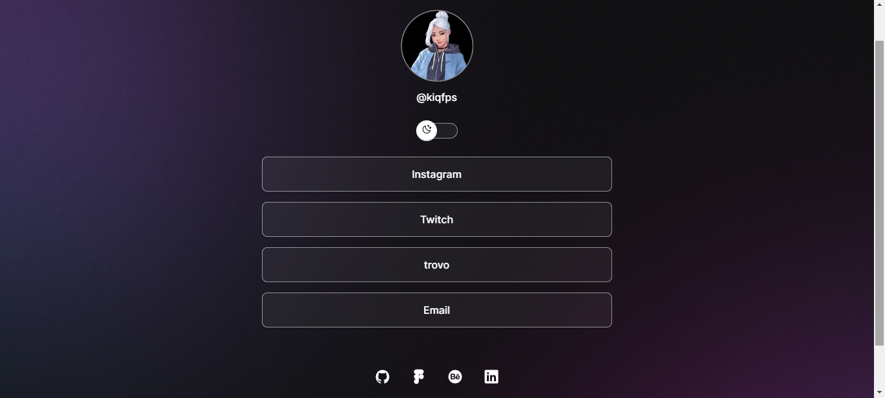
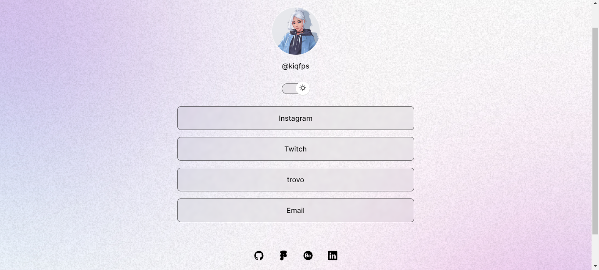

<h1 align="center"> LinKs </h1>

Aplicação construída junto a RocketSeat, com o objetivo de unificar seus Links Sociais, facilitando o acesso a todos eles.  

  <a href="#-tecnologias">Tecnologias</a>&nbsp;&nbsp;&nbsp;|&nbsp;&nbsp;&nbsp;
  <a href="#-projeto">Projeto</a>&nbsp;&nbsp;&nbsp;|&nbsp;&nbsp;&nbsp;
  <a href="#-layout">Layout</a>&nbsp;&nbsp;&nbsp;|&nbsp;&nbsp;&nbsp;
  <a href="#memo-licença">Licença</a>

  

 

  

  

## 🚀 Tecnologias

Esse projeto foi desenvolvido com as seguintes tecnologias:

- HTML e CSS
- JavaScript
- Git e Github
- Figma

## 💻 Projeto

Divulgue de maneira prática seus veículos de comunicação.

- [Acesse o projeto finalizado, online](https://kiqprado.github.io/LinKs/)

## :memo: Licença

Esse projeto está sob a licença MIT.

---

  
  &nbsp;&nbsp;&nbsp;|&nbsp;&nbsp;&nbsp;
  
 

